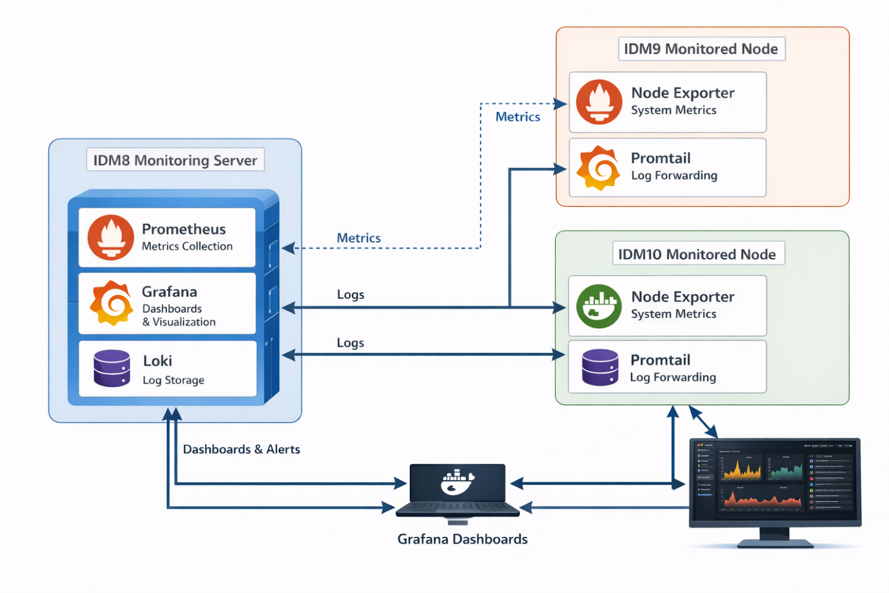

# Centralized Log Monitoring with Grafana, Loki, Promtail, Prometheus, and Alerts with Docker Containerization

Di sebuah IT infarstruktur yang modern, sebagai seorang DevOps Engineer meng handle banyak server, yang digunakan untuk tempat aplikasi dan service berjalan. Setiap server membuat logs (seperti system errors, application events, access records) dan (CPU, Memory, Disk Space, etc). manage resource secara individu itu akan sulit karena:
- Butuh check logs dari masing masing server jika terjadi masalah
- Logs mungkin bisa hilang atau terhapus
- Sulit mencari masalah jika lebih dari 1 server

Centralized logging mengatasi masalah tersebut, seperti menyimapan server logs dan metrics dalam 1 tempat. dimana kita bisa analyze, visualize, and alert ke masing masing server menggunakan 1 aplikasi opensource.

Berikut masing-masing role dari tools yg digunakan :
1. Grafana - sebuah alat dashboard visual, untuk monitoring traffic, metrics, dan logs. membuatnya menjadi sebuah graphs, chart, tables yang mudah dilihat.
2. Loki - Sistem agregasi log yang mirip dengan Elasticsearch tetapi lebih ringan. Sistem ini menyimpan log dari beberapa server dan terintegrasi dengan sempurna dengan Grafana.
3. Promtail - Sebuah agen yang diinstal pada server yang mengumpulkan log (dari berkas seperti /var/log/messages) dan mengirimkannya ke Loki.
4. Prometheus -  Sistem pengumpulan metrik dan pemberitahuan. Sistem ini mengumpulkan metrik CPU, memori, penggunaan disk, dan aplikasi dari server.
5. Node Exporter - Ini adalah agen yang berjalan di setiap server untuk mengumpulkan metrik tingkat sistem untuk Prometheus.
6. Alertmanager - Mengirimkan pemberitahuan (email, Slack, dll.) berdasarkan metrik atau pola log yang didefinisikan di Prometheus.

Dengan menggunakan Docker, kita dapat mengimplementasikan semua alat ini dengan cepat tanpa perlu khawatir tentang ketergantungan atau perbedaan sistem operasi. Docker juga memudahkan untuk menskalakan pemantauan ke beberapa mesin virtual (VM), seperti server Infra, dengan menjalankan Promtail dan Node Exporter di setiap server.

<b>Architecture Overview :</b>

Environment Details:
- Monitoring Host: <b>idm8-monitoring - 10.0.0.223 </b>  

dan 2 server target untuk di monitoring:
- <b>10.0.1.189 idm9-target1</b>
- <b>10.0.4.14  idm10-target2</b>

<b>Operating System: `Debian Linux ` </b>

Prerequisites:

1. 1 Linux host untuk monitoring 2 server lainnya
2. Docker and Docker Compose
3. Internet Connectivity
4. Port yg perlu terbuka :
- 3000 (Grafana | Web Dashboard) 
- 3100 (Loki | Log Aggregation)
- 9090 (Prometheus | Metrics Collection)
- 9093 (Alert Manager | Alerts and Notification)
- 9100 (Node Exporter | System Metrics )
